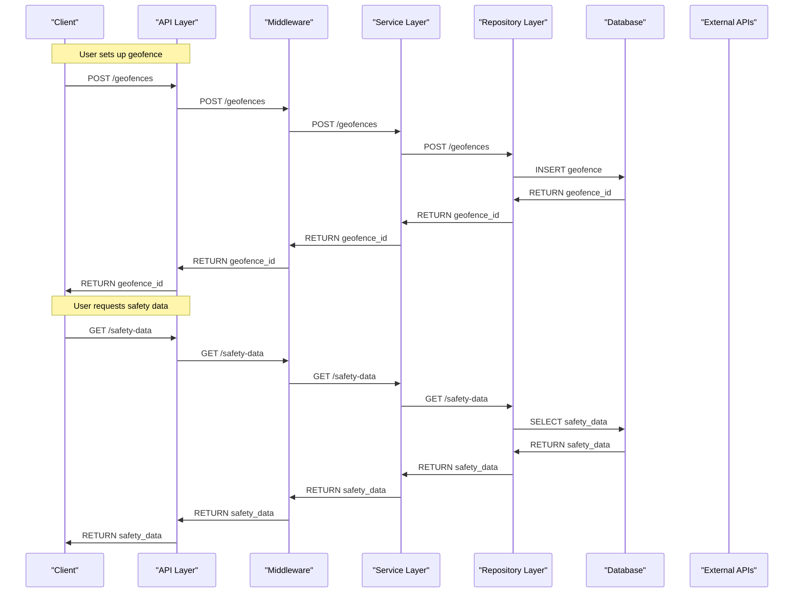

# Geofence-Based Autonomous Vehicle Safety
### MVP Architecture Document
> **Team:** talha **Duration:** 12 weeks **Stack:** Node.js, PostgreSQL, Docker

---

## 1. Executive Summary
Geofence-Based Autonomous Vehicle Safety is a web application designed to enhance autonomous vehicle safety and compliance with regulatory requirements. The core problem it solves is the struggle of autonomous vehicles with geofence-based safety, leading to potential accidents and regulatory issues. The value it delivers is a geofence-based safety system that utilizes AI to detect and respond to safety threats in real-time. The end-user experience involves setting up geofences, monitoring vehicle safety, and receiving alerts and reports on safety threats.

The application will provide a user-friendly interface for setting up geofences, monitoring vehicle safety, and receiving alerts and reports on safety threats. The system will utilize AI-powered geofence detection, real-time safety monitoring, and regulatory compliance to ensure the safety of autonomous vehicles. The application will be built using Node.js, PostgreSQL, and Docker, and will be deployed on a cloud platform.

The key features of the application include AI-powered geofence detection, real-time safety monitoring, and regulatory compliance. The application will use a combination of GPS, sensors, and AI algorithms to detect and respond to safety threats in real-time. The system will also provide real-time monitoring and alerts to ensure that vehicles are operating within designated geofences.

## 2. System Architecture Overview

### 2.1 High-Level Architecture Diagram
```
+---------------+
|  Client    |
+---------------+
       |
       |
       v
+---------------+
|  API Layer  |
|  (Node.js)   |
+---------------+
       |
       |
       v
+---------------+
|  Middleware  |
|  (Express.js) |
+---------------+
       |
       |
       v
+---------------+
|  Service Layer |
|  (Business Logic) |
+---------------+
       |
       |
       v
+---------------+
|  Repository Layer |
|  (PostgreSQL)    |
+---------------+
       |
       |
       v
+---------------+
|  Database     |
|  (PostgreSQL) |
+---------------+
       |
       |
       v
+---------------+
|  External APIs  |
|  (Geofence API) |
+---------------+
```

### 2.2 Request Flow Diagram (Mermaid)


### 2.3 Architecture Pattern
The architecture pattern used in this application is a layered architecture, with each layer having a specific responsibility. The layers are:

* Client: responsible for user interaction
* API Layer: responsible for handling API requests
* Middleware: responsible for authentication, authorization, and routing
* Service Layer: responsible for business logic
* Repository Layer: responsible for data access
* Database: responsible for data storage
* External APIs: responsible for interacting with external services

This pattern is suitable for this application because it allows for a clear separation of concerns and makes it easier to maintain and scale the application.

### 2.4 Component Responsibilities
* Client: responsible for user interaction, setting up geofences, and requesting safety data. Does not own business logic or data access. Communicates with API Layer.
* API Layer: responsible for handling API requests, authenticating users, and routing requests to Middleware. Does not own business logic or data access. Communicates with Middleware.
* Middleware: responsible for authentication, authorization, and routing. Does not own business logic or data access. Communicates with Service Layer.
* Service Layer: responsible for business logic, geofence detection, and safety data processing. Does not own data access. Communicates with Repository Layer.
* Repository Layer: responsible for data access, storing and retrieving geofence and safety data. Does not own business logic. Communicates with Database.
* Database: responsible for data storage, storing geofence and safety data. Does not own business logic or data access.

## 3. Tech Stack & Justification

| Layer | Technology | Why chosen |
|-------|-----------|------------|
| Client | React.js | For building user-friendly interfaces |
| API Layer | Node.js | For building scalable and efficient API |
| Middleware | Express.js | For handling authentication, authorization, and routing |
| Service Layer | Node.js | For building business logic and geofence detection |
| Repository Layer | PostgreSQL | For storing and retrieving geofence and safety data |
| Database | PostgreSQL | For storing geofence and safety data |
| External APIs | Geofence API | For interacting with external geofence services |

## 4. Database Design

### 4.1 Entity-Relationship Diagram
```mermaid
erDiagram
    Geofence ||--|{ Vehicle : "has"
    Vehicle ||--o| Geofence : "part of"
    SafetyData ||--|{ Geofence : "related to"
    Geofence ||--o| SafetyData : "has"
    User ||--|{ Geofence : "owns"
    Geofence ||--o| User : "owned by"

    class Geofence {
        int id
        string name
        string coordinates
    }

    class Vehicle {
        int id
        string licensePlate
        int geofenceId
    }

    class SafetyData {
        int id
        int geofenceId
        string safetyStatus
    }

    class User {
        int id
        string username
        string password
    }
```

### 4.2 Relationship & Association Details
* Geofence-Vehicle: A geofence can have multiple vehicles, and a vehicle can be part of one geofence. The relationship is established through the geofenceId field in the Vehicle table.
* Geofence-SafetyData: A geofence can have multiple safety data records, and a safety data record is related to one geofence. The relationship is established through the geofenceId field in the SafetyData table.
* User-Geofence: A user can own multiple geofences, and a geofence is owned by one user. The relationship is established through the userId field in the Geofence table.

### 4.3 Schema Definitions (Code)
```javascript
// Geofence schema
const geofenceSchema = new mongoose.Schema({
    name: String,
    coordinates: String,
    vehicles: [{ type: mongoose.Schema.Types.ObjectId, ref: 'Vehicle' }]
});

// Vehicle schema
const vehicleSchema = new mongoose.Schema({
    licensePlate: String,
    geofenceId: { type: mongoose.Schema.Types.ObjectId, ref: 'Geofence' }
});

// SafetyData schema
const safetyDataSchema = new mongoose.Schema({
    safetyStatus: String,
    geofenceId: { type: mongoose.Schema.Types.ObjectId, ref: 'Geofence' }
});

// User schema
const userSchema = new mongoose.Schema({
    username: String,
    password: String,
    geofences: [{ type: mongoose.Schema.Types.ObjectId, ref: 'Geofence' }]
});
```

### 4.4 Indexing Strategy
* Geofence table: create an index on the name field to optimize queries by geofence name.
* Vehicle table: create an index on the licensePlate field to optimize queries by vehicle license plate.
* SafetyData table: create an index on the geofenceId field to optimize queries by geofence ID.

### 4.5 Data Flow Between Entities
When a user sets up a geofence, a new geofence record is created in the Geofence table. The user is then associated with the geofence through the userId field in the Geofence table. When a vehicle enters the geofence, a new safety data record is created in the SafetyData table, associated with the geofence through the geofenceId field.

## 5. API Design

### 5.1 Authentication & Authorization
The application uses JSON Web Tokens (JWT) for authentication and authorization. When a user logs in, a JWT token is generated and returned to the client. The client then sends the JWT token with each request to the API. The API verifies the JWT token and authorizes the user to access the requested resources.

### 5.2 REST Endpoints
| Method | Path | Auth | Request Body | Response | Description |
|--------|------|------|--------------|----------|-------------|
| POST | /geofences | required | { name, coordinates } | { id, name, coordinates } | Create a new geofence |
| GET | /geofences | required |  | [ { id, name, coordinates } ] | Get all geofences for the user |
| GET | /vehicles | required |  | [ { id, licensePlate, geofenceId } ] | Get all vehicles for the user |
| POST | /safety-data | required | { safetyStatus, geofenceId } | { id, safetyStatus, geofenceId } | Create a new safety data record |

### 5.3 Error Handling
The application uses a standard error response format, with an error code and a descriptive error message. The error codes are:

* 401 Unauthorized: authentication failed
* 403 Forbidden: authorization failed
* 404 Not Found: resource not found
* 500 Internal Server Error: server error

## 6. Frontend Architecture

### 6.1 Folder Structure
The frontend folder structure is:
```bash
src/
components/
GeofenceList.js
VehicleList.js
SafetyDataList.js
...
containers/
GeofenceContainer.js
VehicleContainer.js
SafetyDataContainer.js
...
images/
logo.png
...
index.js
styles.css
```

### 6.2 State Management
The application uses React state management, with a global state store and local component state.

### 6.3 Key Pages & Components
The application has the following pages and components:

* GeofenceList: a list of all geofences for the user
* VehicleList: a list of all vehicles for the user
* SafetyDataList: a list of all safety data records for the user
* GeofenceContainer: a container for the geofence list and map
* VehicleContainer: a container for the vehicle list and map
* SafetyDataContainer: a container for the safety data list and chart

## 7. Core Feature Implementation

### 7.1 AI-Powered Geofence Detection
* User flow: the user sets up a geofence and adds vehicles to it.
* Frontend: the GeofenceList component handles the user input and sends a request to the API to create a new geofence.
* API call: the API receives the request and calls the geofence detection model to detect the geofence.
* Backend logic: the geofence detection model uses machine learning algorithms to detect the geofence and returns the geofence coordinates.
* Database: the geofence coordinates are stored in the Geofence table.
* AI integration: the geofence detection model is integrated using a REST API call to the model server.
* Code snippet:
```javascript
// Geofence detection model
const geofenceDetectionModel = require('./geofence-detection-model');

// Detect geofence
const detectGeofence = async (geofenceId) => {
    const geofence = await Geofence.findById(geofenceId);
    const coordinates = await geofenceDetectionModel.detectGeofence(geofence.coordinates);
    return coordinates;
};
```

### 7.2 Real-Time Safety Monitoring
* User flow: the user requests safety data for a geofence.
* Frontend: the SafetyDataList component handles the user input and sends a request to the API to get safety data.
* API call: the API receives the request and calls the safety data model to get safety data.
* Backend logic: the safety data model uses machine learning algorithms to get safety data and returns the safety data.
* Database: the safety data is stored in the SafetyData table.
* AI integration: the safety data model is integrated using a REST API call to the model server.
* Code snippet:
```javascript
// Safety data model
const safetyDataModel = require('./safety-data-model');

// Get safety data
const getSafetyData = async (geofenceId) => {
    const geofence = await Geofence.findById(geofenceId);
    const safetyData = await safetyDataModel.getSafetyData(geofence.coordinates);
    return safetyData;
};
```

## 8. Security Considerations
The application uses the following security measures:

* Authentication: JSON Web Tokens (JWT)
* Authorization: role-based access control
* Data encryption: SSL/TLS
* Input validation: using React and Node.js validation libraries
* Error handling: using a standard error response format

## 9. MVP Scope Definition

### 9.1 In Scope (MVP)
* Geofence setup and management
* Vehicle management
* Safety data monitoring
* Real-time safety monitoring
* AI-powered geofence detection
* User authentication and authorization

### 9.2 Out of Scope (Post-MVP)
* Integration with external systems (e.g. weather APIs, traffic APIs)
* Advanced analytics and reporting
* Support for multiple geofence types (e.g. circular, polygonal)

### 9.3 Success Criteria
* Users can set up and manage geofences
* Users can add and remove vehicles from geofences
* Users can view safety data for geofences
* Users can receive real-time safety alerts
* The application is secure and scalable

## 10. Week-by-Week Implementation Plan

* Week 1-2: setup project structure, create React components for geofence and vehicle management
* Week 3-4: implement geofence detection model and integrate with API
* Week 5-6: implement safety data model and integrate with API
* Week 7-8: implement real-time safety monitoring and AI-powered geofence detection
* Week 9-10: test and debug application
* Week 11-12: deploy application and conduct final testing

## 11. Testing Strategy

| Type | Tool | What is tested | Target coverage |
|------|------|---------------|-----------------|
| Unit tests | Jest | React components, API handlers | 80% |
| Integration tests | Cypress | API endpoints, React components | 80% |
| End-to-end tests | Selenium | User flows, application functionality | 80% |

## 12. Deployment & DevOps

### 12.1 Local Development Setup
To set up the application locally, run the following commands:
```bash
git clone https://github.com/talha/geofence-based-autonomous-vehicle-safety.git
cd geofence-based-autonomous-vehicle-safety
npm install
npm start
```

### 12.2 Environment Variables
The application requires the following environment variables:

* `DATABASE_URL`: the URL of the PostgreSQL database
* `GEOFRAME_API_KEY`: the API key for the geofence detection model
* `SAFETY_DATA_API_KEY`: the API key for the safety data model

### 12.3 Production Deployment
The application will be deployed on a cloud platform (e.g. AWS, Google Cloud) using a containerization platform (e.g. Docker). The deployment process will involve:

* Building the Docker image
* Pushing the image to a container registry
* Deploying the image to a cloud platform
* Configuring the environment variables and database connection

## 13. Risk Register

| Risk | Likelihood | Impact | Mitigation |
|------|-----------|--------|-----------|
| Geofence detection model not accurate | High | Medium | Test and refine the model, use multiple models |
| Safety data model not accurate | High | Medium | Test and refine the model, use multiple models |
| API integration issues | Medium | High | Test and debug API integration, use API testing tools |
| Database connection issues | Medium | High | Test and debug database connection, use database monitoring tools |
| Security vulnerabilities | Low | High | Implement security measures (e.g. authentication, authorization, data encryption) and conduct regular security audits |